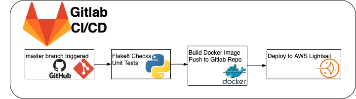

[](https://github.com/psf/black)
[](https://github.com/JoshuaSchlichting/sweng894-capstone/actions/workflows/main.yml)
[](https://github.com/JoshuaSchlichting/sweng894-capstone/actions/workflows/unit-testing.yml)


Penn State University SWENG 894 Capstone Experience

Author/maintainer: Joshua Schlichting
___
# ✔️ Sortofair Voting System 🗳️
#### An instant-runoff voting system designed to give voters a web based voting experience without the lopsidedness of two party rule.

<!-- ## CI/CD High level diagram -->
<!--  -->


# Instructions
## k8s
Create the EKS Kubernetes cluster
```
eksctl create cluster \
  --name fargate-eks \
  --region us-east-1 \
  --zones=us-east-1a,us-east-1b,us-east-1d \
  --instance-types=t2.nano \
  --fargate
  # optional to view yaml output
  # --dry-run 
```

Now we need to update the kubectl config stored in github secrets
```
gh secret set KUBE_CONFIG_DATA -b $(cat ~/.kube/config | base64)
```

Now we need to add the pipeline user's ARN to the cluster as an admin
```
eksctl create iamidentitymapping \
    --cluster fargate-eks  \
    --arn {{ secrets.PIPELINE_USER_ARN }} \
    --group system:masters \
    --username cicd-runner
```

Now the pipeline can be run for deployment.

to shutdown the cluster ($$$$), execute the following:
```
eksctl delete cluster --name fargate-eks
```

## Prep MongoDB Atlas
```
mongosh "mongodb+srv://cluster0.knkim.mongodb.net/vote_system" --username admin
```